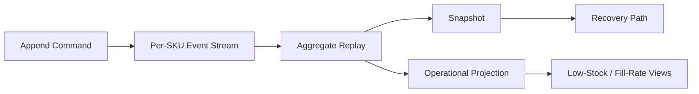

# Inventory Event Store RS

Rust event-sourced inventory engine with aggregate rebuilding, snapshots, optimistic concurrency enforcement, and operational projections for low-stock visibility.

## Why This Exists

Shaped like the core of a warehouse or fulfillment system where event history is authoritative, conflicting writes must be rejected cleanly, and operators still need read-friendly projections.

## What This Demonstrates

- event sourcing fundamentals with aggregate replay
- optimistic concurrency checks on stream appends
- snapshot generation and snapshot-assisted recovery paths
- operational projections for low-stock posture and fill-rate visibility

## Architecture



## Design Notes

1. Writes enforce explicit expected-version checks to make concurrency behavior visible.
2. The aggregate owns inventory correctness while projections expose operator-facing health signals.
3. Recovery can start from a snapshot and apply only the remaining tail of the stream.

## Run It

```bash
cargo check
cargo test
cargo run
```

## Verification

Use `cargo check` for compile validation on this machine. `cargo test` is expected to work once the MSVC linker (`link.exe`) is installed.

## Further Reading

- [Architecture](./docs/ARCHITECTURE.md)
- [Benchmarking Notes](./docs/BENCHMARKING.md)
